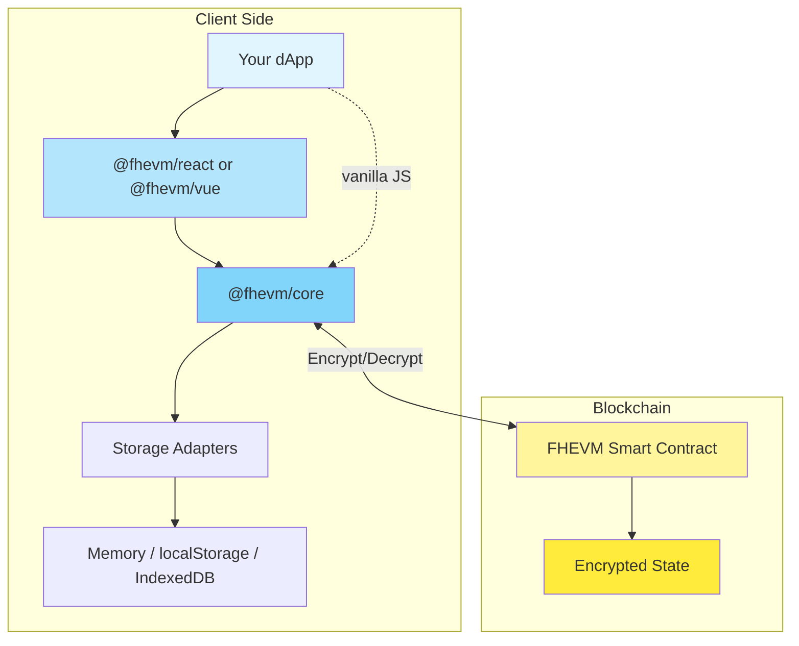

# FHEVM SDK

<div align="center">

**Framework-agnostic SDK for building privacy-preserving dApps with Fully Homomorphic Encryption**

[](LICENSE)
[](https://www.npmjs.com/package/@0xbojack/fhevm-core)
[](https://www.npmjs.com/package/@0xbojack/create-fhevm-dapp)

[Documentation](https://docs.zama.ai/fhevm) • [Examples](#-live-examples) • [Quick Start](#-quick-start) • [Packages](#-packages)

</div>

---

## 🎯 What is FHEVM?

**FHEVM (Fully Homomorphic Encryption Virtual Machine)** enables computation on encrypted data directly on the blockchain. Build dApps where smart contracts can perform complex computations while keeping user data completely private.

### Why FHEVM SDK?

- **🔐 Privacy-First**: Encrypt sensitive data client-side before sending to blockchain
- **🎯 Framework-Agnostic**: Core library works with any JavaScript framework
- **⚡ Developer-Friendly**: React hooks and Vue composables for rapid development
- **💾 Flexible Storage**: Choose from Memory, localStorage, or IndexedDB
- **🧪 Local Development**: Mock support for Hardhat testing
- **📦 Production-Ready**: Tree-shakeable ESM + CJS builds with TypeScript

---

## 🚀 Quick Start

Looking to scaffold a full dApp quickly? Follow the [create-fhevm-dapp quickstart](packages/create-fhevm-dapp/README.md) for a guided setup.

### React

```tsx
import { FhevmProvider, useInit, useEncrypt } from '@fhevm/react';
import { BrowserProvider } from 'ethers';

// 1. Wrap your app
function App() {
  return (
    <FhevmProvider>
      <YourApp />
    </FhevmProvider>
  );
}

// 2. Initialize and use
function YourApp() {
  const { init } = useInit();
  const { encrypt } = useEncrypt();

  // Initialize FHEVM
  const handleInit = async () => {
    const provider = new BrowserProvider(window.ethereum);
    await init({ provider });
  };

  // Encrypt data
  const handleEncrypt = async () => {
    const result = await encrypt({
      value: 42,
      type: 'euint32',
      contractAddress: '0x...',
      userAddress: '0x...',
    });
    // Use result.handles and result.inputProof in your contract call
  };

  return (
    <div>
      <button onClick={handleInit}>Initialize FHEVM</button>
      <button onClick={handleEncrypt}>Encrypt Value</button>
    </div>
  );
}
```

### Vue 3

```vue
<script setup>
import { useInit, useEncrypt } from '@fhevm/vue';
import { BrowserProvider } from 'ethers';
import { onMounted } from 'vue';

const { init, isReady } = useInit();
const { encrypt, data } = useEncrypt();

// Initialize FHEVM on mount
onMounted(async () => {
  const provider = new BrowserProvider(window.ethereum);
  await init({ provider });
});

// Encrypt data
const handleEncrypt = async () => {
  await encrypt({
    value: 42,
    type: 'euint32',
    contractAddress: '0x...',
    userAddress: '0x...',
  });
};
</script>

<template>
  <div v-if="isReady">
    <button @click="handleEncrypt">Encrypt Value</button>
    <pre v-if="data">{{ data }}</pre>
  </div>
</template>
```

### Vanilla JavaScript

```javascript
import { FhevmClient } from '@fhevm/core';
import { BrowserProvider } from 'ethers';

// Create and initialize client
const client = new FhevmClient();
const provider = new BrowserProvider(window.ethereum);
await client.init({ provider });

// Encrypt data
const encrypted = await client.encrypt({
  value: 42,
  type: 'euint32',
  contractAddress: '0x...',
  userAddress: '0x...',
});

// Decrypt data
const signer = await provider.getSigner();
const decrypted = await client.decrypt(
  [{ handle: '0x...', contractAddress: '0x...' }],
  signer
);
```

---

## 📦 Packages

This monorepo contains these packages:

### [@fhevm/core](packages/core)

Framework-agnostic FHEVM client library.

```bash
npm install @fhevm/core ethers
```

**Features:**
- ✅ Fully Homomorphic Encryption for blockchain
- ✅ Multiple storage adapters (Memory, localStorage, IndexedDB)
- ✅ EIP-712 signature caching (365-day decryption authorization)
- ✅ Mock support for Hardhat development
- ✅ Tree-shakeable ESM + CJS builds
- ✅ Full TypeScript support

[📖 Documentation](packages/core/README.md)

### [@fhevm/react](packages/react)

React hooks for FHEVM.

```bash
npm install @fhevm/react @fhevm/core ethers
```

**Features:**
- ✅ wagmi-like hooks: `useInit`, `useEncrypt`, `useDecrypt`, `useStatus`, `usePublicKey`
- ✅ `FhevmProvider` context for easy setup
- ✅ Auto-cancellation and cleanup on unmount
- ✅ Full TypeScript support
- ✅ Built on @fhevm/core

[📖 Documentation](packages/react/README.md)

### [@fhevm/vue](packages/vue)

Vue 3 composables for FHEVM.

```bash
npm install @fhevm/vue @fhevm/core ethers
```

**Features:**
- ✅ Composition API: `useInit`, `useEncrypt`, `useDecrypt`, `useStatus`, `usePublicKey`
- ✅ Vue plugin system with `createFhevm()`
- ✅ Reactive state management with Vue refs
- ✅ Auto-cleanup on component unmount
- ✅ Full TypeScript support
- ✅ Built on @fhevm/core

[📖 Documentation](packages/vue/README.md)

### [create-fhevm-dapp](packages/create-fhevm-dapp)

CLI toolkit for scaffolding new FHEVM-enabled dApps in minutes.

```bash
npx @0xbojack/create-fhevm-dapp
```

**NPM:** [@0xbojack/create-fhevm-dapp](https://www.npmjs.com/package/@0xbojack/create-fhevm-dapp)


---

## 🎨 Live Examples

### Next.js 15 + React Demo

Full-featured React application with RainbowKit wallet integration and FHECounter contract.

📂 **Code:** [examples/nextjs](examples/nextjs)
🚀 **Live Demo:** [Next.js Online Demo](https://github.com/huaigu/fhevm-sdk)

**Features:**
- Next.js 15 + React 19
- RainbowKit wallet connection
- Tailwind CSS + DaisyUI
- FHECounter encrypted counter demo
- Sepolia testnet support

```bash
cd examples/nextjs
pnpm install
pnpm dev
```

### Vue 3 + Vite Demo

Minimal Vue 3 application demonstrating FHEVM composables.

📂 **Code:** [examples/vue](examples/vue)
🚀 **Live Demo:** Coming soon

**Features:**
- Vue 3 Composition API
- Vite for fast development
- Minimal dependencies
- FHECounter encrypted counter demo
- Sepolia testnet support

```bash
cd examples/vue
pnpm install
pnpm dev
```

---

## 🏗️ Architecture



### How It Works

1. **Initialization**: Connect to Ethereum provider and fetch public keys
2. **Encryption**: Encrypt sensitive data client-side before sending to blockchain
3. **Computation**: Smart contracts perform operations on encrypted data
4. **Decryption**: Request decryption with EIP-712 signature (cached for 365 days)
5. **Storage**: Cache public keys and signatures in your chosen storage adapter

---

## 🔧 Development

### Prerequisites

- Node.js >= 18
- pnpm >= 8
- Git

### Setup

```bash
# Clone repository
git clone https://github.com/zama-ai/fhevm-sdk.git
cd fhevm-sdk

# Initialize submodules (includes fhevm-hardhat-template)
git submodule update --init --recursive

# Install dependencies
pnpm install

# Build all packages
pnpm build

# Run tests
pnpm test
```

### Project Structure

```
fhevm-sdk/
├── packages/
│   ├── core/           # @fhevm/core - Framework-agnostic SDK
│   ├── react/          # @fhevm/react - React hooks
│   └── vue/            # @fhevm/vue - Vue 3 composables
├── examples/
│   ├── nextjs/         # Next.js 15 + React example
│   └── vue/            # Vue 3 + Vite example
├── contracts/          # fhevm-hardhat-template submodule
└── scripts/            # Build and deployment scripts
```

### Local Development with Hardhat

```bash
# Terminal 1: Start local Hardhat node
cd contracts
pnpm chain

# Terminal 2: Deploy contracts to localhost
pnpm deploy:localhost

# Terminal 3: Run example app
cd examples/nextjs  # or examples/vue
pnpm dev
```

---

## 📚 Resources

### Documentation

- **[FHEVM Documentation](https://docs.zama.ai/fhevm)** - Complete FHEVM guide
- **[Hardhat Development](https://docs.zama.ai/protocol/solidity-guides/development-guide/hardhat)** - Local development setup
- **[Relayer SDK](https://docs.zama.ai/protocol/relayer-sdk-guides/)** - Decryption relayer guide

### Package Documentation

- **[@fhevm/core](packages/core/README.md)** - Core SDK API reference
- **[@fhevm/react](packages/react/README.md)** - React hooks API reference
- **[@fhevm/vue](packages/vue/README.md)** - Vue composables API reference

### Examples

- **[Next.js Example](examples/nextjs/README.md)** - Full React application
- **[Vue Example](examples/vue/README.md)** - Minimal Vue 3 application

## 🤝 Contributing

We welcome contributions! Please see our contributing guidelines for more details.

### Development Workflow

1. Fork the repository
2. Create a feature branch: `git checkout -b feature/amazing-feature`
3. Make your changes and commit: `git commit -m 'feat: add amazing feature'`
4. Push to your fork: `git push origin feature/amazing-feature`
5. Open a Pull Request

### Code Standards

- Follow existing code style
- Add tests for new features
- Update documentation
- Ensure all tests pass: `pnpm test`
- Ensure builds succeed: `pnpm build`

---

## 📄 License

This project is licensed under the **MIT License**. See [LICENSE](LICENSE) for details.

---

<div align="center">

**[⭐ Star this repo](https://github.com/zama-ai/fhevm-sdk)** if you find it useful!

Made with ❤️ by 0xbojack

</div>
