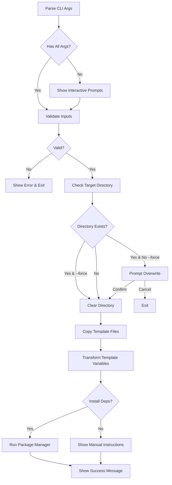

# create-fhevm-dapp CLI Package Design

## Overview

A CLI tool for scaffolding FHEVM dApps with framework-specific templates (Vue, React). Next.js support will be added later when the example is ready.

**Command**: `npx create-fhevm-dapp [framework] [app-name] [options]`

**Key Requirements**:
1. Support **Vue** and **React** templates (Next.js coming later)
2. Include **contracts** from `packages/hardhat/` in each template
3. Reference root `package.json` scripts for contract operations
4. Each example is self-contained with its own contracts folder

---

## Key Updates from Original Plan

### ✅ Corrected Scope
1. **Framework Support**: Vue + React (not Next.js initially)
   - Vue: Ready (has complete example)
   - React: Coming soon (needs example creation)
   - Next.js: Future (separate from React)

2. **Contract Integration**: Each template includes full Hardhat setup
   - Contracts from `packages/hardhat/contracts/`
   - Deploy scripts from `packages/hardhat/deploy/`
   - Hardhat config from `packages/hardhat/hardhat.config.ts`
   - Merged package.json scripts from root

3. **Self-Contained Templates**: No workspace dependencies
   - Frontend + Contracts in single directory
   - Can be used standalone outside monorepo
   - Users can publish to their own repos

### 📦 Template Structure

```
Generated dApp:
├── contracts/           # From packages/hardhat/
│   └── FHECounter.sol
├── deploy/              # From packages/hardhat/
│   └── deploy.ts
├── hardhat.config.ts    # From packages/hardhat/
├── src/                 # From examples/{framework}/
│   └── ...
└── package.json         # Merged (frontend + hardhat deps + scripts)
```

### 🎯 User Experience

**Single Command**:
```bash
npx create-fhevm-dapp vue my-app
cd my-app

# Terminal 1: Chain
pnpm chain

# Terminal 2: Deploy
pnpm deploy:localhost

# Terminal 3: Frontend
pnpm dev
```

**Complete Workflow**: Frontend + Contracts + Deploy in <5 minutes

---

## 1. Package Architecture

### 1.1 Package Location
```
packages/
└── create-fhevm-dapp/
    ├── package.json
    ├── tsconfig.json
    ├── src/
    │   ├── index.ts              # CLI entry point
    │   ├── cli.ts                # Command parsing & orchestration
    │   ├── prompts.ts            # Interactive prompts
    │   ├── templates.ts          # Template registry & config
    │   ├── generator.ts          # File copying & transformation
    │   ├── validator.ts          # Input validation
    │   └── utils/
    │       ├── logger.ts         # Colored console output
    │       ├── spinner.ts        # Loading indicators
    │       └── fileSystem.ts     # File operations
    ├── templates/
    │   ├── vue/                  # Vue template files
    │   ├── react/                # React template files (future)
    │   └── nextjs/               # Next.js template files
    └── README.md
```

### 1.2 Template Sources

**Templates are COPIED from `examples/` + `packages/hardhat/` at build time**

```
Source Structure:
examples/vue-app/       → templates/vue/
examples/react-app/     → templates/react/ (when ready)
packages/hardhat/       → templates/{framework}/contracts/ (for all)

Each template includes:
- Frontend code from examples/
- Contracts from packages/hardhat/contracts/
- Deploy scripts from packages/hardhat/deploy/
- Hardhat config from packages/hardhat/
- Root package.json scripts reference
```

**Why include contracts in each template?**
- Self-contained: Each dApp has its own contracts folder
- Independent: No workspace dependencies
- Flexible: Users can modify contracts without affecting monorepo
- Standard: Follows typical dApp project structure

**React vs Next.js Status**:
- ✅ **React**: Standalone React app with Vite (priority)
- ⏳ **Next.js**: Waiting for example to be created
- ✅ **Vue**: Already has complete example

---

## 2. CLI Interface Design

### 2.1 Usage Patterns

**Pattern 1: Positional Arguments**
```bash
npx create-fhevm-dapp vue my-app
npx create-fhevm-dapp react my-dapp
# Next.js coming soon
```

**Pattern 2: Interactive Prompts (No Args)**
```bash
npx create-fhevm-dapp
# → Framework selection prompt (vue, react)
# → App name prompt
# → Package manager prompt
# → Install dependencies prompt
```

**Pattern 3: Flags**
```bash
npx create-fhevm-dapp --framework vue --name my-app
npx create-fhevm-dapp -f react -n my-dapp --skip-install
npx create-fhevm-dapp --help
npx create-fhevm-dapp --version
```

### 2.2 Command Flags

| Flag | Alias | Description | Default |
|------|-------|-------------|---------|
| `--framework <type>` | `-f` | Framework choice (vue\|react) | Interactive prompt ||| `--framework <type>` | `-f` | Framework choice (vue\|react) | Interactive prompt ||| `--framework <type>` | `-f` | Framework choice (vue\|react) | Interactive prompt |
| `--name <name>` | `-n` | App name | Interactive prompt |
| `--skip-install` | `-s` | Skip dependency installation | `false` |
| `--package-manager <pm>` | `-p` | Use specific PM (pnpm\|npm\|yarn) | Auto-detect |
| `--force` | - | Overwrite existing directory | `false` |
| `--help` | `-h` | Show help message | - |
| `--version` | `-v` | Show version | - |

### 2.3 Interactive Prompts

```typescript
// Example flow with no arguments
const answers = await prompts([
  {
    type: 'select',
    name: 'framework',
    message: 'Which framework do you want to use?',
    choices: [
      { title: 'Vue', value: 'vue', description: 'Vue 3 with Vite + @0xbojack/fhevm-vue' },
      { title: 'React', value: 'react', description: 'React with Vite + @0xbojack/fhevm-react' },
      { title: 'Next.js', value: 'nextjs', description: 'React framework with SSR (Coming Soon)', disabled: true }
    ]
  },
  {
    type: 'text',
    name: 'appName',
    message: 'What is your project name?',
    initial: 'my-fhevm-dapp',
    validate: (value) => isValidPackageName(value) || 'Invalid package name'
  },
  {
    type: 'select',
    name: 'packageManager',
    message: 'Which package manager?',
    choices: [
      { title: 'pnpm (recommended)', value: 'pnpm' },
      { title: 'npm', value: 'npm' },
      { title: 'yarn', value: 'yarn' }
    ]
  },
  {
    type: 'confirm',
    name: 'installDeps',
    message: 'Install dependencies now?',
    initial: true
  }
])
```

---

## 3. Template Structure

### 3.1 Template Registry

```typescript
// src/templates.ts
export const TEMPLATES = {
  vue: {
    name: 'Vue',
    description: 'Vue 3 + Vite + @0xbojack/fhevm-vue',
    source: 'examples/vue-app',
    packageName: '@0xbojack/fhevm-vue',
    available: true
  },
  react: {
    name: 'React',
    description: 'React + Vite + @0xbojack/fhevm-react',
    source: 'examples/react-app',
    packageName: '@0xbojack/fhevm-react',
    available: false // Coming soon - waiting for example
  },
  nextjs: {
    name: 'Next.js',
    description: 'Next.js 15 + @0xbojack/fhevm-nextjs',
    source: 'examples/nextjs-app',
    packageName: '@0xbojack/fhevm-nextjs',
    available: false // Coming soon - needs separate example
  }
}
```

### 3.2 Template File Structure

**Each template includes:**
```
templates/{framework}/
├── .env.example              # Environment variables template
├── .gitignore               # Git ignore rules
├── package.json             # Dependencies + contract scripts (merged)
├── tsconfig.json            # TypeScript config
├── README.md                # Framework-specific instructions
├── [framework-config]       # vite.config.ts / next.config.ts
├── hardhat.config.ts        # Hardhat configuration (from packages/hardhat/)
├── contracts/               # Smart contracts (from packages/hardhat/)
│   └── FHECounter.sol
├── deploy/                  # Deploy scripts (from packages/hardhat/)
│   └── deploy.ts
└── src/                     # Frontend source code
    └── ...
```

**Contract Integration**:
- `contracts/`: Copied from `packages/hardhat/contracts/`
- `deploy/`: Copied from `packages/hardhat/deploy/`
- `hardhat.config.ts`: Copied from `packages/hardhat/hardhat.config.ts`
- `package.json`: Merges frontend deps + hardhat deps + contract scripts from root

### 3.3 Template Variables

**Dynamic replacement during generation:**

```json
// package.json template
{
  "name": "{{APP_NAME}}",
  "version": "0.1.0",
  "private": true,
  "description": "{{DESCRIPTION}}",
  "scripts": {
    "dev": "vite",
    "build": "vite build",
    "chain": "hardhat node --network hardhat --no-deploy",
    "compile": "hardhat compile",
    "deploy:localhost": "hardhat deploy --network localhost",
    "deploy:sepolia": "hardhat deploy --network sepolia"
  },
  "dependencies": {
    "{{FHEVM_PACKAGE}}": "^{{FHEVM_VERSION}}",
    "ethers": "^6.13.4"
  },
  "devDependencies": {
    "hardhat": "^2.26.0",
    "hardhat-deploy": "^0.11.45",
    "@fhevm/hardhat-plugin": "^0.1.0",
    "@fhevm/solidity": "^0.8.0"
  }
}
```

**Variables:**
- `{{APP_NAME}}`: User-provided app name
- `{{DESCRIPTION}}`: Auto-generated description (e.g., "FHEVM Vue dApp")
- `{{FHEVM_PACKAGE}}`: Framework-specific package (`@0xbojack/fhevm-vue`, `@0xbojack/fhevm-react`)
- `{{FHEVM_VERSION}}`: Current SDK version (read from root package.json)

**Script Merging Strategy:**
- Frontend scripts: From `examples/{framework}/package.json`
- Contract scripts: From root `package.json` (chain, compile, deploy, etc.)
- Merged into single `package.json` in generated template

### 3.4 Files to Exclude from Templates

```typescript
const EXCLUDE_FILES = [
  'node_modules/**',
  'dist/**',
  '.next/**',
  'build/**',
  '.turbo/**',
  'tsconfig.tsbuildinfo',
  'pnpm-lock.yaml',
  'yarn.lock',
  'package-lock.json'
]
```

---

## 4. Generation Flow

### 4.1 Process Steps



### 4.2 File Copy & Transformation

```typescript
async function generateApp(config: GeneratorConfig) {
  const { framework, appName, targetDir } = config
  
  // 1. Resolve template source
  const templateDir = path.join(__dirname, '../templates', framework)
  
  // 2. Copy files with filtering
  await copyTemplate(templateDir, targetDir, {
    exclude: EXCLUDE_FILES,
    transform: (content, filePath) => {
      // Transform template variables
      if (filePath.endsWith('.json') || filePath.endsWith('.md')) {
        return content
          .replace(/\{\{APP_NAME\}\}/g, appName)
          .replace(/\{\{FHEVM_PACKAGE\}\}/g, TEMPLATES[framework].packageName)
          .replace(/\{\{FHEVM_VERSION\}\}/g, getFhevmVersion())
      }
      return content
    }
  })
  
  // 3. Initialize git (optional)
  if (config.initGit) {
    await execAsync('git init', { cwd: targetDir })
  }
  
  // 4. Install dependencies
  if (config.installDeps) {
    await installDependencies(targetDir, config.packageManager)
  }
}
```

---

## 5. Technical Implementation

### 5.1 Dependencies

**Runtime Dependencies:**
```json
{
  "dependencies": {
    "commander": "^12.0.0",          // CLI argument parsing
    "prompts": "^2.4.2",             // Interactive prompts
    "chalk": "^5.3.0",               // Colored output
    "ora": "^8.0.1",                 // Spinner/loading
    "fs-extra": "^11.2.0",           // File operations
    "validate-npm-package-name": "^6.0.0"  // Package name validation
  }
}
```

**Dev Dependencies:**
```json
{
  "devDependencies": {
    "@types/node": "^22.7.5",
    "@types/prompts": "^2.4.9",
    "@types/fs-extra": "^11.0.4",
    "typescript": "^5.9.2",
    "tsup": "^8.5.0"
  }
}
```

### 5.2 Build Configuration

**package.json:**
```json
{
  "name": "create-fhevm-dapp",
  "version": "0.1.0",
  "type": "module",
  "bin": {
    "create-fhevm-dapp": "./dist/index.js"
  },
  "files": [
    "dist",
    "templates"
  ],
  "scripts": {
    "build": "tsup src/index.ts --format esm --dts --clean",
    "dev": "tsup src/index.ts --format esm --watch",
    "prepublishOnly": "pnpm build && pnpm copy-templates"
  }
}
```

**tsup.config.ts:**
```typescript
import { defineConfig } from 'tsup'

export default defineConfig({
  entry: ['src/index.ts'],
  format: ['esm'],
  dts: true,
  clean: true,
  shims: true,
  target: 'node20',
  banner: {
    js: '#!/usr/bin/env node'
  }
})
```

### 5.3 Template Copying Script

**scripts/copy-templates.ts:**
```typescript
// Copy examples/ + contracts to create-fhevm-dapp/templates/ during build
import fs from 'fs-extra'
import path from 'path'

const EXAMPLES_DIR = path.join(__dirname, '../examples')
const HARDHAT_DIR = path.join(__dirname, '../packages/hardhat')
const TEMPLATES_DIR = path.join(__dirname, '../packages/create-fhevm-dapp/templates')
const ROOT_PACKAGE = path.join(__dirname, '../package.json')

const TEMPLATE_MAP = {
  'vue-app': 'vue',
  'react-app': 'react' // When available
}

async function copyTemplates() {
  // Clear existing templates
  await fs.emptyDir(TEMPLATES_DIR)
  
  // Copy each example to templates
  for (const [source, target] of Object.entries(TEMPLATE_MAP)) {
    const sourcePath = path.join(EXAMPLES_DIR, source)
    const targetPath = path.join(TEMPLATES_DIR, target)
    
    // 1. Copy frontend code
    await fs.copy(sourcePath, targetPath, {
      filter: (src) => {
        // Exclude build artifacts
        return !src.includes('node_modules') &&
               !src.includes('dist') &&
               !src.includes('.next') &&
               !src.includes('tsconfig.tsbuildinfo')
      }
    })
    
    // 2. Copy contracts
    await fs.copy(
      path.join(HARDHAT_DIR, 'contracts'),
      path.join(targetPath, 'contracts')
    )
    
    // 3. Copy deploy scripts
    await fs.copy(
      path.join(HARDHAT_DIR, 'deploy'),
      path.join(targetPath, 'deploy')
    )
    
    // 4. Copy hardhat config
    await fs.copy(
      path.join(HARDHAT_DIR, 'hardhat.config.ts'),
      path.join(targetPath, 'hardhat.config.ts')
    )
    
    // 5. Merge package.json with contract scripts
    await mergePackageJson(targetPath, ROOT_PACKAGE)
    
    console.log(`✅ Copied ${source} + contracts → templates/${target}`)
  }
}

async function mergePackageJson(targetPath: string, rootPackagePath: string) {
  const templatePkg = await fs.readJson(path.join(targetPath, 'package.json'))
  const rootPkg = await fs.readJson(rootPackagePath)
  
  // Merge contract scripts from root
  const contractScripts = {
    'chain': rootPkg.scripts.chain,
    'compile': rootPkg.scripts.compile,
    'deploy:localhost': rootPkg.scripts['contract:deploy'],
    'deploy:sepolia': rootPkg.scripts['contract:deploy:sepolia']
  }
  
  templatePkg.scripts = {
    ...templatePkg.scripts,
    ...contractScripts
  }
  
  // Add hardhat dependencies
  templatePkg.devDependencies = {
    ...templatePkg.devDependencies,
    'hardhat': '^2.26.0',
    'hardhat-deploy': '^0.11.45',
    '@fhevm/hardhat-plugin': '^0.1.0',
    '@fhevm/solidity': '^0.8.0',
    '@nomicfoundation/hardhat-ethers': '^3.1.0',
    '@typechain/hardhat': '^9.1.0',
    'typechain': '^8.3.2'
  }
  
  await fs.writeJson(path.join(targetPath, 'package.json'), templatePkg, { spaces: 2 })
}

copyTemplates().catch(console.error)
```

---

## 6. User Experience

### 6.1 Success Output

```bash
$ npx create-fhevm-dapp vue my-dapp

✔ Framework · Vue
✔ App name · my-dapp
✔ Package manager · pnpm
✔ Install dependencies · Yes

Creating FHEVM dApp...
✔ Copied frontend template
✔ Copied smart contracts
✔ Copied deploy scripts
✔ Merged package.json
✔ Installing dependencies...

🎉 Success! Created my-dapp at /path/to/my-dapp

Your FHEVM dApp includes:
  📁 Frontend (Vue 3 + Vite)
  📝 Smart Contracts (Hardhat + FHEVM)
  🚀 Deploy Scripts

Inside that directory, you can run:

  pnpm dev
    Starts the frontend dev server

  pnpm chain
    Starts a local Hardhat node

  pnpm compile
    Compiles smart contracts

  pnpm deploy:localhost
    Deploys contracts to local chain

We suggest you begin by:

  cd my-dapp
  
  # Terminal 1: Start local chain
  pnpm chain
  
  # Terminal 2: Deploy contracts
  pnpm deploy:localhost
  
  # Terminal 3: Start frontend
  pnpm dev

📚 Documentation: https://github.com/0xbojack/fhevm-sdk
🐛 Issues: https://github.com/0xbojack/fhevm-sdk/issues

Happy coding! 🚀
```

### 6.2 Error Handling

```typescript
// Example error scenarios
const ERRORS = {
  INVALID_NAME: 'Invalid package name. Must be lowercase and URL-safe.',
  DIR_EXISTS: 'Directory already exists. Use --force to overwrite.',
  NETWORK_ERROR: 'Failed to install dependencies. Please run manually.',
  UNSUPPORTED_FRAMEWORK: 'Framework not supported yet. Available: vue, nextjs'
}

// Graceful error display
function handleError(error: Error, code: string) {
  console.error(chalk.red('✖'), chalk.bold('Error:'), error.message)
  console.error(chalk.dim(`Code: ${code}`))
  process.exit(1)
}
```

---

## 7. Testing Strategy

### 7.1 Unit Tests

**Test coverage:**
- Input validation (app names, framework types)
- Template variable replacement
- File filtering logic
- Error handling

```typescript
// Example test
describe('validator', () => {
  it('should validate package names', () => {
    expect(isValidPackageName('my-app')).toBe(true)
    expect(isValidPackageName('My-App')).toBe(false) // Uppercase
    expect(isValidPackageName('@scope/app')).toBe(true)
  })
})
```

### 7.2 Integration Tests

```bash
# Test full generation flow
pnpm test:integration

# Creates temp directories and tests:
# 1. Generate Vue app
# 2. Generate Next.js app
# 3. Verify file structure
# 4. Verify package.json transformations
# 5. Test with different flags
```

### 7.3 Manual Testing Checklist

- [ ] Run with no arguments (interactive mode)
- [ ] Run with positional args: `nextjs my-app`
- [ ] Run with flags: `--framework vue --name test-app`
- [ ] Test `--skip-install` flag
- [ ] Test `--force` overwrite
- [ ] Test each framework template
- [ ] Verify generated app runs: `pnpm dev`
- [ ] Verify generated app builds: `pnpm build`

---

## 8. Documentation

### 8.1 README.md Structure

```markdown
# create-fhevm-dapp

Scaffold FHEVM dApps with your favorite framework.

## Quick Start

\`\`\`bash
npx create-fhevm-dapp
\`\`\`

## Usage

\`\`\`bash
npx create-fhevm-dapp [framework] [name] [options]
\`\`\`

### Frameworks

- `nextjs` - Next.js with @0xbojack/fhevm-nextjs
- `vue` - Vue 3 with @0xbojack/fhevm-vue
- `react` - React with @0xbojack/fhevm-react (Coming Soon)

### Options

[Table of flags]

## Examples

[Various usage examples]

## What's Included?

[List of features in each template]
```

### 8.2 Template READMEs

Each template should include:
- Quick start instructions
- Environment setup (`.env.example`)
- Available scripts explanation
- Framework-specific gotchas
- Links to SDK documentation

---

## 9. Publishing & Distribution

### 9.1 NPM Package Configuration

```json
{
  "name": "create-fhevm-dapp",
  "version": "0.1.0",
  "description": "Create FHEVM dApps with framework templates",
  "keywords": [
    "fhevm",
    "zama",
    "confidential",
    "dapp",
    "scaffold",
    "cli",
    "vue",
    "react",
    "nextjs"
  ],
  "repository": {
    "type": "git",
    "url": "https://github.com/0xbojack/fhevm-sdk",
    "directory": "packages/create-fhevm-dapp"
  },
  "author": "0xbojack",
  "license": "BSD-3-Clause-Clear"
}
```

### 9.2 Publishing Workflow

```bash
# 1. Build all packages
pnpm build

# 2. Copy templates
pnpm --filter create-fhevm-dapp copy-templates

# 3. Version bump (using changesets)
pnpm changeset

# 4. Publish
pnpm release
```

---

## 10. Future Enhancements

### 10.1 Phase 1 (MVP)
- [ ] CLI argument parsing
- [ ] Interactive prompts
- [ ] Vue template + contracts
- [ ] Template variable replacement
- [ ] Dependency installation
- [ ] Contract integration (copy + merge)

### 10.2 Phase 2
- [ ] React template (when example available)
- [ ] Next.js template (when example available)
- [ ] TypeScript/JavaScript choice
- [ ] Git initialization option
- [ ] Advanced configuration options
- [ ] Multiple contract templates (ERC20, Voting, etc.)

### 10.3 Phase 3
- [ ] Example contract selection (Counter, ERC20, Voting)
- [ ] Smart contract deployment wizard
- [ ] Environment detection (.env setup)
- [ ] CI/CD template generation

### 10.4 Phase 4
- [ ] Plugin system for custom templates
- [ ] Community template registry
- [ ] Update checker (`npx create-fhevm-dapp@latest`)
- [ ] Analytics (opt-in usage stats)

---

## 11. Contract Integration Details

### 11.1 Files from packages/hardhat/

**Smart Contracts** (`contracts/`):
- `FHECounter.sol` - Example encrypted counter contract with:
  - `increment()` - Increment encrypted counter
  - `decrement()` - Decrement encrypted counter
  - `getCount()` - Get encrypted count (client-side decrypt)
  - `requestDecryptCount()` - Request on-chain decryption
  - `callbackDecryptCount()` - Decryption callback

**Deploy Scripts** (`deploy/`):
- `deploy.ts` - Hardhat deploy script using hardhat-deploy

**Configuration**:
- `hardhat.config.ts` - Hardhat configuration with:
  - Network settings (localhost, sepolia)
  - Compiler settings
  - hardhat-deploy plugin
  - typechain plugin

### 11.2 Package.json Script Mapping

**From Root** → **To Template**:
```json
{
  "chain": "hardhat node --network hardhat --no-deploy",
  "compile": "hardhat compile",
  "deploy:localhost": "hardhat deploy --network localhost",
  "deploy:sepolia": "hardhat deploy --network sepolia",
  "generate": "hardhat typechain"
}
```

**From Example** → **To Template** (Vue):
```json
{
  "dev": "vite",
  "build": "vue-tsc && vite build",
  "preview": "vite preview"
}
```

**Final Merged Result**:
```json
{
  "scripts": {
    "dev": "vite",
    "build": "vue-tsc && vite build",
    "preview": "vite preview",
    "chain": "hardhat node --network hardhat --no-deploy",
    "compile": "hardhat compile",
    "deploy:localhost": "hardhat deploy --network localhost",
    "deploy:sepolia": "hardhat deploy --network sepolia",
    "generate": "hardhat typechain"
  }
}
```

### 11.3 Template README Structure

Each generated dApp should have a comprehensive README:

```markdown
# {APP_NAME}

FHEVM dApp built with {Framework} and Hardhat.

## Quick Start

### 1. Install Dependencies
\`\`\`bash
pnpm install
\`\`\`

### 2. Start Local Chain
\`\`\`bash
pnpm chain
\`\`\`

### 3. Deploy Contracts (new terminal)
\`\`\`bash
pnpm deploy:localhost
\`\`\`

### 4. Start Frontend (new terminal)
\`\`\`bash
pnpm dev
\`\`\`

## Project Structure
\`\`\`
├── contracts/        # FHEVM smart contracts
├── deploy/           # Hardhat deploy scripts
├── src/              # Frontend source
├── hardhat.config.ts # Hardhat configuration
└── package.json
\`\`\`

## Available Scripts
- \`pnpm dev\` - Start frontend dev server
- \`pnpm build\` - Build frontend for production
- \`pnpm chain\` - Start local Hardhat node
- \`pnpm compile\` - Compile smart contracts
- \`pnpm deploy:localhost\` - Deploy to local chain
- \`pnpm deploy:sepolia\` - Deploy to Sepolia testnet

## Smart Contracts

### FHECounter
Encrypted counter demonstrating FHEVM capabilities.

**Functions:**
- \`increment(encryptedValue, proof)\` - Add encrypted value
- \`decrement(encryptedValue, proof)\` - Subtract encrypted value
- \`getCount()\` - Get encrypted count (requires client decryption)
- \`requestDecryptCount()\` - Request on-chain decryption

## Environment Variables

Copy \`.env.example\` to \`.env\` and fill in:

\`\`\`
VITE_SEPOLIA_RPC_URL=your_rpc_url
VITE_CONTRACT_ADDRESS=deployed_contract_address
\`\`\`

## Learn More
- [FHEVM Documentation](https://docs.zama.ai)
- [FHEVM SDK](https://github.com/0xbojack/fhevm-sdk)
```

## 12. Implementation Checklist

### Package Setup
- [ ] Create `packages/create-fhevm-dapp/` directory
- [ ] Initialize package.json with bin entry
- [ ] Configure tsup for ESM build
- [ ] Add shebang (`#!/usr/bin/env node`) to entry

### Core Implementation
- [ ] `src/index.ts` - Entry point
- [ ] `src/cli.ts` - Commander setup
- [ ] `src/prompts.ts` - Prompts configuration
- [ ] `src/templates.ts` - Template registry
- [ ] `src/generator.ts` - File copying logic
- [ ] `src/validator.ts` - Input validation
- [ ] `src/utils/logger.ts` - Console output
- [ ] `src/utils/spinner.ts` - Loading indicators

### Template Preparation
- [ ] Create `scripts/copy-templates.ts`
- [ ] Add `copy-templates` script to root package.json
- [ ] Implement frontend template copying from examples/
- [ ] Implement contract copying from packages/hardhat/
- [ ] Implement package.json merging logic
- [ ] Test template copying with all components
- [ ] Verify template variable replacement
- [ ] Verify contract scripts work in generated template

### Testing
- [ ] Write unit tests for validators
- [ ] Write unit tests for template transformation
- [ ] Create integration test suite
- [ ] Test all CLI flag combinations

### Documentation
- [ ] Write comprehensive README
- [ ] Document all CLI flags
- [ ] Create usage examples
- [ ] Add troubleshooting section

### Publishing
- [ ] Configure NPM package metadata
- [ ] Add to workspace build pipeline
- [ ] Test local installation: `npm link`
- [ ] Test npx usage: `npx create-fhevm-dapp`

---

## 12. Estimated Timeline

**Total: 5-7 days**

| Phase | Task | Time |
|-------|------|------|
| 1 | Package setup & scaffolding | 0.5 day |
| 2 | CLI parsing & prompts | 1 day |
| 3 | Template copying & transformation | 1.5 days |
| 4 | Dependency installation logic | 1 day |
| 5 | Testing & bug fixes | 1 day |
| 6 | Documentation | 0.5 day |
| 7 | Publishing & validation | 0.5 day |

---

## 13. Success Metrics

**User Experience:**
- ✅ Time to first working dApp: <5 minutes
- ✅ Lines of code to run: 1 (`npx create-fhevm-dapp`)
- ✅ Zero configuration needed
- ✅ Works with all major package managers

**Technical:**
- ✅ All templates generate successfully
- ✅ Generated apps run without errors
- ✅ Test coverage >80%
- ✅ No runtime dependencies on monorepo

**Adoption:**
- ✅ Included in bounty submission
- ✅ Documented in main README
- ✅ Published to NPM
- ✅ Showcased in video walkthrough

---

## 14. References

**Similar Tools (Inspiration):**
- `create-next-app`: https://nextjs.org/docs/api-reference/create-next-app
- `create-vite`: https://vitejs.dev/guide/#scaffolding-your-first-vite-project
- `create-react-app`: https://create-react-app.dev/
- `@wagmi/cli create`: https://wagmi.sh/cli/api/commands/create

**Key Differences:**
- Template-based (copy from examples/) vs wizard-based
- Framework-agnostic core SDK
- Pre-configured FHEVM integration
- Confidential smart contract boilerplate included
